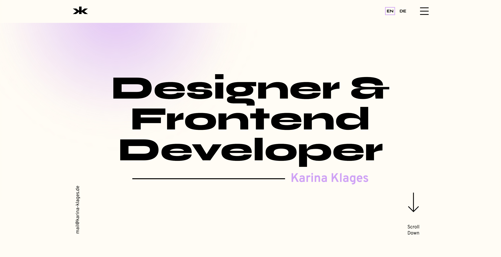
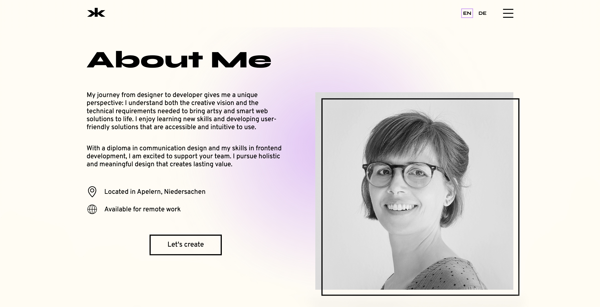
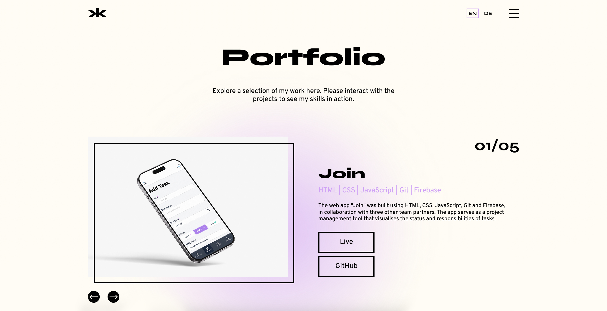
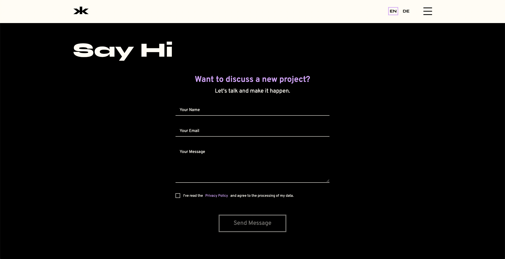

<h1 align="left">Portfolio</h1>

###

In my portfolio, I showcase my technical expertise, creativity, problem-solving skills, work style, and current projects. 

My technical expertise is built on a solid foundation of hands-on experience and continuous learning. Creativity drives my decision from the initial concept to the final outcome. When it comes to problem-solving, I combine structured thinking with adaptability to find solutions that are both effective and sustainable. My work style is collaborative, reliable, and detail-oriented, whether I'm working independently or as part of a team. The projects I'm currently working on represent where my passion and skills meet — and I'm excited to share them with you. 

This portfolio is part of the Developer Akademie's training programme for software developers (www.developerakademie.com). 
  

[Live View](https://karina-klages.de)

###

 

 

 

