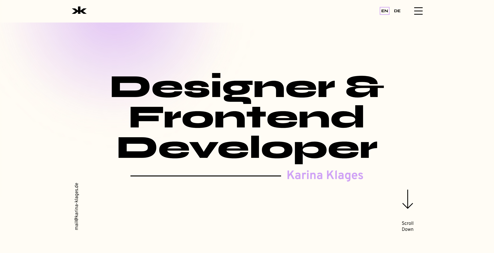

# Portfolio

A personal portfolio website built with HTML, CSS, JavaScript, and PHP. It showcases technical expertise, creativity, problem-solving skills, work style, and current projects.

The portfolio is part of the Developer Akademie's training programme for software developers ([www.developerakademie.com](https://www.developerakademie.com)).

**[LIVE VIEW](https://karina-klages.de)**



## Table of Contents

- [Prerequisites](#prerequisites)
- [Quickstart](#quickstart)
- [Project Structure](#project-structure)

## Prerequisites

- A modern browser
- A local server (required for the PHP contact form), e.g. [XAMPP](https://www.apachefriends.org/) or [MAMP](https://www.mamp.info/)

## Quickstart

Clone the repository:

```bash
git clone https://github.com/karinaklages/portfolio.git
cd portfolio
```

Open `index.html` directly in your browser — or serve the project via a local PHP server for full contact form support:

```bash
php -S localhost:8000
```

Then open:

```text
http://localhost:8000
```

## Project Structure

```text
portfolio/
├── assets/
│   ├── fonts/                              # Local font files
│   ├── icons/                              # Icon assets
│   ├── img/                                # Images and screenshots
│   └── scripts/
│       ├── contact-template.js             # Contact section template
│       ├── footer-template.js              # Footer template
│       ├── form-validation.js              # Contact form validation
│       ├── header-template.js              # Header template
│       ├── header.js                       # Header logic
│       ├── i18n.js                         # Internationalisation
│       ├── legal-notice-privacy-policy.js  # Legal pages template
│       ├── portfolio-template.js           # Portfolio section template
│       ├── skills-template.js              # Skills section template
│       └── translations.js                 # Translation strings
├── styles/
│   ├── about-me.css
│   ├── contact.css
│   ├── fonts.css
│   ├── footer.css
│   ├── header-menu.css
│   ├── legal-notice-privacy-policy.css
│   ├── mobile.css                          # Responsive styles
│   ├── portfolio.css
│   ├── references.css
│   ├── skills.css
│   └── standard.css
├── index.html                              # Main entry point
├── legal-notice.html                       # Legal notice page
├── privacy-policy.html                     # Privacy policy page
├── mail.php                                # Contact form backend
├── script.js                               # Core logic
└── style.css                               # Main stylesheet
```